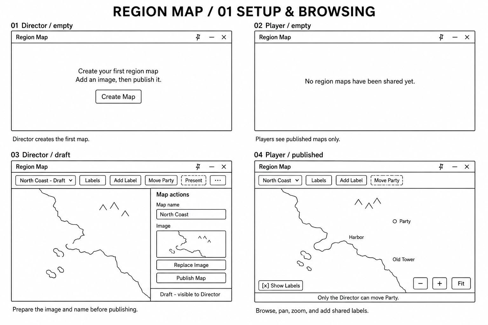
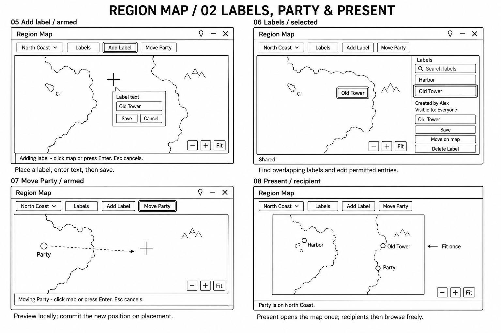
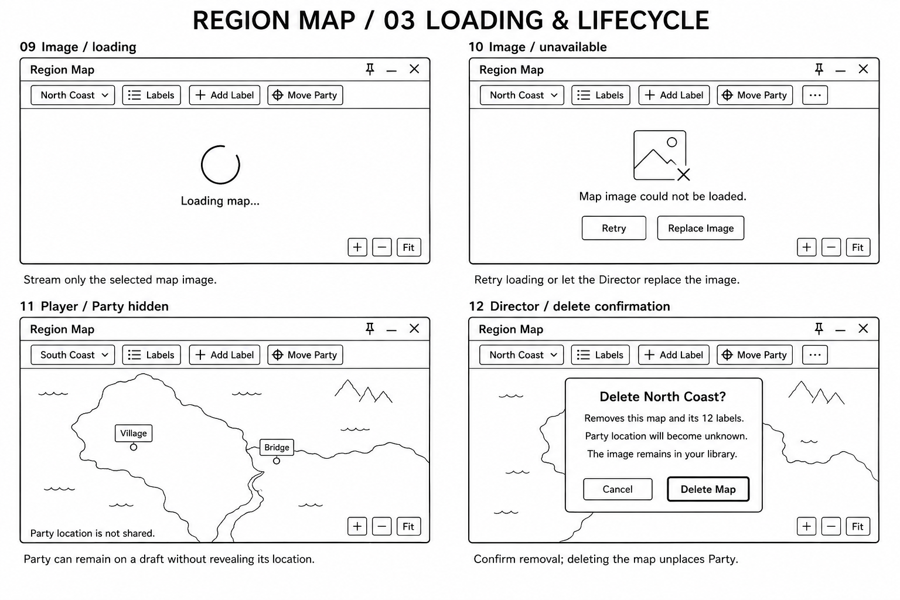

# Region Map: design, implementation, validation, and roadmap

**Single maintained reference for the independent Region Map CodeMod.**
Consolidated: 2026-09-06. Knowledge checked against current source and the recorded validation below.

**Current status:** simplified v1 is implemented in source. The last recorded assertion run passed 39 groups. Deployment and ordinary live acceptance are still outstanding; this is not a release-ready claim.

This document replaces the separate brief, development plan, corrective plans, review-status summary, deployment handoff, and UI-guide prose. The obsolete documents, redirects, and archived prose copies have been removed. Update this document for future decisions and status changes.

## Contents

- [1. Current status and decisions](#1-current-status-and-decisions)
- [2. Approved v1 behavior](#2-approved-v1-behavior)
- [3. Architecture and source map](#3-architecture-and-source-map)
- [4. Data, persistence, and synchronization](#4-data-persistence-and-synchronization)
- [5. UI guide](#5-ui-guide)
- [6. Player-facing copy](#6-player-facing-copy)
- [7. Review findings and repairs](#7-review-findings-and-repairs)
- [8. Validation evidence and limits](#8-validation-evidence-and-limits)
- [9. Remaining v1 delivery plan](#9-remaining-v1-delivery-plan)
- [10. Deferred feature plan](#10-deferred-feature-plan)
- [11. Development and maintenance rules](#11-development-and-maintenance-rules)
- [12. Supporting artifacts](#12-supporting-artifacts)

## 1. Current status and decisions

### Status vocabulary

| Label | Meaning |
| --- | --- |
| Approved | Product behavior already decided with the user. |
| Implemented | An inspected source path exists. This alone does not prove live correctness. |
| Verified in isolation | An assertion exercised production Lua with fake game/storage/GUI services. |
| Verified live, limited | A specific action was observed in the running application; only that action is established. |
| Outstanding | Required acceptance or environment work has not been completed. |
| Deferred candidate | Outside v1. The feature is recorded for later design, not approved implementation. |

### Current snapshot

| Area | State |
| --- | --- |
| Independent source | Five Lua files under Region Map/, using existing public DMHub services. |
| Simplified v1 | Implemented; no coordinator, reservation service, or engine change required. |
| Regression assertions | Last recorded run: 39 groups passed on 2026-09-06. |
| Source validation | All five files compiled and were ASCII-only at the last handoff; no whitespace errors reported for the inspected changes. |
| Real-GUI validation | Limited mock-data smoke test, including empty/management views, input identity, and literal-text behavior. |
| Multiplayer acceptance | Outstanding. Fixtures do not establish actual multi-client delivery or input behavior. |
| Deployment | Installation rolled back on 2026-09-06. Core UI recovered and verified after reload; Region Map remains disabled with its staged files outside the watched folder. Its development-folder refresh loop must be resolved before reinstalling. See D0. |
| Deferred expansion | Candidate backlog organized in section 10; no committed expansion version, dates, or implementation schedule. |

Documentation consolidation changes no runtime source and does not constitute a fresh test run.

### Decision ledger

| Date / provenance | Decision and current effect |
| --- | --- |
| Earlier approved brief | Independent addon-owned image canvas; generic DMHub dependencies; one Party marker; no tactical-map or Draw Steel rules coupling. |
| 2026-08-27, recorded host amendment | Use the journal-style PanelDocument host, with default 1000x800 and target outer minimum 720x480. |
| 2026-09-05 | Code review, corrective implementation, UI schematics, and isolated regression work established the implementation and remaining acceptance gaps. |
| 2026-09-06, user-approved simplification | GUID identity replaces name uniqueness. The label threshold is soft. Shared edits use ordinary last-write-wins. Party stays in its document. Deletion cleanup and Present are best effort. |
| 2026-09-06, consolidation and cleanup requests | This document becomes the sole design/status/roadmap reference. Obsolete documents, redirects, and archived prose copies are removed; source, tests, and image artifacts remain. |

### Guarantees deliberately removed from v1

Do not reintroduce these as prerequisites while completing v1:

- Globally unique map names or a hard cross-client 250-label quota.
- Exhaustive conflict detection or a notice for every winning remote edit.
- Coordinator clients, automatic elections, command queues, and distributed reservations.
- A Party storage migration solely to obtain a save badge.
- Proof of atomic multi-record deletion or durable shared-document acknowledgements.
- Per-recipient presentation receipts or continuous camera following.

The revised behavior is intentional. These requirements were withdrawn, not secretly satisfied by batching or local checks.

## 2. Approved v1 behavior

### Purpose and boundaries

Region Map lets a Director share image-based regional/world maps and lets the group annotate locations and move a shared Party marker. It provides an independently installed CodeMod and its own canvas.

The journal-style host supplies window behavior; it does not make a region map a journal document. Region Map does not own tactical tokens, tactical-map geometry, combat rules, or character content.

### Windows and map selection

- Register Region Map content with DockablePanel, intercept opening through RegisterDockablePanelOpenHandler, and host it through PanelDocument.
- Default window: 1000x800. Target outer minimum: 720x480. Support dragging, resizing, pinning, closing, and title-bar window shade via the existing host.
- Display an alphabetical map selector. Directors see published maps and drafts, with status tags. Players see published maps only.
- GUIDs identify maps. Names may repeat, including case variants. When accessible names collide under the existing case fold, append a short unique ID prefix in brackets. Expand it when short prefixes collide.
- Hidden drafts must not influence player disambiguation. Selection and remembered preferences always use GUIDs.
- Badge the accessible map containing Party.
- Restore the viewer's last accessible map. Otherwise choose the first published map; Directors may fall back to the first draft.

### Canvas and navigation

- Stream only the selected image. Preserve its aspect ratio and clip it to the viewport.
- Store positions as normalized image coordinates u,v. Letterbox space is not part of the image and cannot receive a placement.
- Keep zoom/center and Show Labels local to each user/map; key cameras by map and image revision.
- Fit is minimum zoom; maximum is 20x. Provide Fit, zoom buttons, cursor-anchored wheel zoom, left-background drag, and right/middle-button pan.
- Navigation is the normal tool state. Add Label, Move Party, and label repositioning are explicit placement operations.
- Add Label and Move Party are mutually exclusive. Click places; Enter places at viewport center; Escape cancels and restores the appropriate prior local state.
- Crossing a drag threshold pans without consuming an armed placement tool.
- Authorized markers can be directly dragged in navigation mode. Preview locally and submit once on drop.
- Canvas-focused arrows pan, with Shift for coarse movement; selected-marker repositioning supports nudges. Inputs and tactical tokens must not receive unintended navigation commands.

The last point still requires full real-pointer/key acceptance; a passing fixture is insufficient.

### Labels

- Plain, trimmed, single-line text of 1-80 valid UTF-8 characters. Empty input creates nothing. Text resembling markup renders literally.
- Directors manage all labels and may create shared or Director-only labels.
- Players create shared labels and edit/move/delete only their own. Player-authored labels remain shared after Director edits.
- Label visuals are theme-aware cartographic text with contrast treatment. Font size follows zoom within approximately 14-28 font-scaled logical pixels.
- Show Labels is local and never hides Party.
- The Labels drawer supports search, author/visibility information, selection, centering without changing zoom, and permitted edit/reposition/nudge/delete actions. It supplies access to overlapping or offscreen labels.
- Preserve dirty editor fields during remote updates. Cancel invalid operations on lost access, deletion, or incompatible state.

### Soft creation limit

The local usable snapshot gates creation at 250 confirmed active labels. At 250 or more, reject another local addition.

Two clients may accept additions against older snapshots and produce more than 250 labels. Preserve all accessible existing labels, including the overshoot. Do not truncate rendering, silently delete submissions, or create a distributed reservation system.

This is a usability/performance guard, not a global quota. Local in-flight protection still prevents accidental resubmission of the same save.

### Party

- One shared Party position across all maps: mapId,u,v, with fixed display text Party.
- Its visual size is independent of map zoom, with at least a 44-pixel logical hit target, rendered above labels.
- Directors move Party. A shared Director-controlled toggle, off by default, lets players move it onto published maps they can browse.
- Party may occupy a draft. Directors see the location; players see no draft name, badge, or marker and receive the not-shared status.
- Publishing reveals Party without moving it. Unpublishing retains its hidden location.
- Party position and the permission toggle stay in the existing shared document using ordinary synchronization. They do not display an unsupported durable-save badge.

### Map lifecycle and Present

- Create maps as drafts using a name and selected/uploaded image.
- Support rename, image replacement, publish/unpublish, and deletion.
- Validate a replacement image before committing it; increment imageRevision, retain normalized overlays, Fit after dimensions settle, and briefly highlight retained overlays.
- A failed candidate should leave the usable image intact. Old/library assets are never automatically deleted.
- Missing images show loading/unavailable states with Retry and a Director replacement path.
- Delete by confirming a deletion marker. The map then becomes inaccessible through read-time filtering. Clear matching Party/Present state and hide associated records independently, best-effort; retry failed record cleanup on a later open.
- Present is a best-effort one-shot request. Recipients that accept it open/raise the window, select the published map, and Fit once. They may immediately browse elsewhere. The originating camera stays independent.
- Present uses regionMapId, a fresh nonce, and a ten-second TTL. Never use tactical mapid. TTL limits instruction freshness, not how long the recipient stays on the map.

## 3. Architecture and source map

### Ownership and load order

| Order | File | Responsibilities and representative entry points |
| --- | --- | --- |
| 1 | [RegionMapModel.lua](<Region Map/RegionMapModel.lua>) | Types, schemas, safe reads, access checks, CreateMap/CreateLabel, UpdateMap/UpdateLabel, WriteParty, MapDisplayNames, UploadRecord, deletion filtering/cleanup, and local preferences. |
| 2 | [RegionMapStyles.lua](<Region Map/RegionMapStyles.lua>) | Feature style rules and theme subscription/unsubscription helpers. |
| 3 | [RegionMapPanel.lua](<Region Map/RegionMapPanel.lua>) | Panel.Create, canvas, marker previews, retained drawers, operation guards, image requests, write feedback, RefreshAll, and presentation handling. |
| 4 | [RegionMap.lua](<Region Map/RegionMap.lua>) | Public-service checks, readiness checks, registration, Addon.Open, and document-window/presentation integration. |
| Compatibility | [Main.lua](<Region Map/Main.lua>) | Retained comment-only no-op for a persisted CodeMod entry. |

RegionMapAddon is the shared namespace. Submodules expose interfaces and ready flags. The bootstrap exposes Open/CreatePanel and coordinate helpers.

Dependencies are generic public services: DockablePanel, PanelDocument, RegisterDockablePanelOpenHandler, ThemeEngine, GameHud, gui.IconEditor, streamed image panels, data tables, module documents, and preferences. DMHub Core UI/Game Hud must load first.

The bootstrap uses the keyed 00-region-map-window handler and existing named registrations. It derives the content-height allowance from the public host resize contract instead of duplicating the header constant.

### Runtime flows

| Trigger | Existing flow |
| --- | --- |
| Open | Addon.Open -> DockablePanel open dispatch -> addon handler -> PanelDocument -> Panel.Create. |
| Shared table/document update | Root monitors -> RefreshAll/HandlePresentation -> accessible selection and state -> image/marker/control/drawer reconciliation. |
| Local camera movement | CalculateImageLayout -> cached marker snapshots -> UpdateCanvasLayout; no repeated persistent-table reads inside that layout pass. |
| Map or label save | UI draft/operation guard -> model validates fresh record/role -> copy before mutation -> UploadRecord -> outcome callback -> UI reconciliation. |
| Party move | Guard and validate -> ordinary document change wrapper -> refreshed shared state. |
| Delete | Model.DeleteMap -> confirmed tombstone -> filtering -> independent cleanup writes. |
| Image change | New request identity -> validated dimensions -> cancel stale geometry -> revision-keyed camera -> retained-overlay highlight. |

### UI lifetime and retained state

- Window-owned operation guards use the captured owning mod, root validity, selected target, and operation identity. An old callback must not become valid merely because RegionMapAddon now points at a newer load.
- Cancelled drags clear preview/start fields; late drops cannot submit.
- Drawer shells, search inputs, selected editor sections, and label rows are retained where possible. Rows reconcile by stable ID.
- Untouched fields may accept refreshed values; dirty fields retain the user's input. Losing access or deleting the target invalidates editing.
- Theme subscriptions are owned by the root and deregistered on destruction.
- Image callbacks use per-request panel identity. Old completions and highlight timers cannot affect a newer image request.
- Some properties are host/build dependent; the complete lifecycle, focus, and geometry behavior still needs the live matrix below.

## 4. Data, persistence, and synchronization

### Storage inventory

| Storage | Important fields / purpose |
| --- | --- |
| RegionMapRecords / RegionMapRecord | id, schemaVersion=1, name, imageId, imageRevision, published, revision, audit fields, hidden. |
| RegionMapLabelRecords / RegionMapLabelRecord | id, schemaVersion, mapId, u/v, text, owner/author snapshot, createdByDirector, shared/director visibility, revision, audit fields, hidden. |
| RegionMapTombstones / RegionMapTombstoneRecord | Map ID and deletion/audit fields. Confirmed markers prevent stale records reviving a deleted map. |
| regionMapState module document | schemaVersion, Party position/audit fields, playerCanMoveParty. Registered for checkpoint backups. |
| regionmap:preferences | Per-game user preference: selected map, image-revision-keyed cameras, Show Labels per map. |
| Model/panel local state | Upload outcomes, retry payloads/IDs, dirty fields, previews, request identities, and cached render snapshots. |

Prefix addon global types/table names with RegionMap. All persistent game data is addon-owned; no dummy Global Rule YAML is used as a mod manifest.

### Reads, validation, and authorization

- Use dmhub.GetTable for these caller-assigned stable IDs, then apply addon schema/hidden/tombstone/publication/visibility filters. The original investigation established that GetTableVisible excludes these rows.
- Safe field access rejects unsupported containers and absent fields. Invalid rows are omitted individually and logged rather than aborting valid rendering.
- Validate persisted text as well as user submissions. Keep numeric coordinates finite and within normalized bounds.
- Bound revision values for formatting, serialization, and safe increment; the current upper constant is 9007199254740991.
- An empty Party document can initialize. Unsupported schemas are not silently consumed, rewritten, or downgraded.
- Map-name folding covers ASCII, Latin-1, Latin Extended-A, and Cyrillic as documented in the source. It is not general Unicode normalization. Folding is used for sorting/disambiguation, not uniqueness.
- Recheck current Director role, accessible map, ownership, tombstone state, and applicable Party permission at every mutation entry point.
- Normal addon clients are trusted. These are application-level checks, not server-enforced confidentiality against hostile clients.

### Table write outcomes

Map/label writes use the verified success/failure options of SetAndUploadTableItem. Its immediate returned ID is not treated as durable confirmation.

Keep pending drafts and stable GUIDs. Do not expose a local unconfirmed creation echo as a usable record. Failed creation retries use the same identity; mutationId metadata supports local retry identity, not exhaustive conflict detection.

Saving/Shared describes the acknowledged table operation. It does not claim every client has displayed the change. Dirty values, current operation identity, and valid controls protect newer edits from late/duplicate outcomes.

No undo guarantee is implied for table-row changes. The old no-op MarkUndo wrapper was removed.

### Shared documents and concurrent editing

Party and permission changes use BeginChange/CompleteChange. V1 relies on ordinary app synchronization with last-write-wins and does not add a durable-save badge or an acknowledgement protocol.

Independent labels remain independent records. Concurrent edits to the same record use normal last-write-wins. Rendering follows the newest received state while unsaved local editor text remains intact. Removed conflict notices/signature caches should not be restored as an accidental requirement.

### Deletion and recovery

1. Validate the current Director operation and submit a tombstone.
2. Wait for the tombstone's table-upload success. A pending/failed local marker does not authorize cleanup.
3. Filter the map and dangling references from normal reads.
4. Independently try matching Present clearing, Party unplacement, map hiding, and label hiding.
5. Preserve Party if its latest location is another map. Unsupported Party state does not prevent a valid map deletion.
6. Skip malformed cleanup rows, avoid duplicating pending cleanup, and retry failed record hides on a later open.

The user's confirmed operation is the deletion marker. Remaining cleanup is best effort, not an atomic transaction. Existing image assets remain in the library. There is no v1 restore-deletion UI.

## 5. UI guide

These are black-and-white schematic concepts generated on 2026-09-05, not runtime screenshots or exact style specifications. Use this document for current behavior and exact copy. Arrow annotations do not introduce routes; illustrative circles/boxes do not introduce rich-pin features.

### Setup and browsing



| State | Meaning / acceptance focus |
| --- | --- |
| 01 Director empty | Clear creation action, no inaccessible selection. |
| 02 Player empty | No shared maps; no draft disclosure or creation controls. |
| 03 Director draft | Prepare name/image and publish; retain dirty drawer input. |
| 04 Player published | Browse, pan/zoom, create shared labels, and obey Party permission. |

### Labels, Party, and Present



| State | Meaning / acceptance focus |
| --- | --- |
| 05 Add Label | Arm placement, choose an image point, enter text, save/cancel. Table-save draft remains while pending. |
| 06 Labels selected | Search/overlap access, author/visibility, authorized editing, retained control identity. |
| 07 Move Party | Authorized preview/placement and Escape cancellation. Ordinary document sync, no durable-save badge. |
| 08 Present recipient | Accept a fresh best-effort request, open/select/Fit once, then browse independently. |

### Loading and lifecycle



| State | Meaning / acceptance focus |
| --- | --- |
| 09 Loading | Stream the selected image; require usable dimensions for placement. |
| 10 Unavailable image | Retry; Director may replace without losing the previous usable image to an invalid candidate. |
| 11 Party hidden | Browse a published map without learning Party's draft location. |
| 12 Delete confirmation | Explain removal and asset retention; confirm the marker and clean up best-effort. |

### Known schematic differences and future guide coverage

- Duplicate names now receive a short ID qualifier. The example sheets use distinct names.
- The draft sketch disables Present; the implementation can expose Present and reject a draft when invoked. Match the approved requirement of no draft presentation, rather than assuming a particular disabled treatment from the picture.
- The actual drawer overlays the canvas; the schematic may appear to reserve a separate column.
- Inline label placement and text entry are simplified in the images.
- The creation-limit copy now describes 250 or more labels. There is no hard global quota or remote-conflict notice.
- Saving/Shared applies only to acknowledged table operations; the sheets are not evidence of document-save or presentation receipts.

Additional guide states to document after verifying their behavior: map creation form, Director-only label visibility, replacement/unpublish confirmations, table-save failure/retry, revoked permission mid-drag, duplicate-name selectors, soft-limit overshoot, and compact/collapsed windows.

The [exact image prompts](output/region-map-ui-guide/PROMPTS.md) remain a reproduction artifact.

## 6. Player-facing copy

The following approved copy was consolidated from the latest brief. Revisions to behavior and copy belong here, not in a separate manifest.

- Panel and controls: `Region Map`, `Map`, `Labels`, `Add Label`, `Move Party`, `Present`, `Fit`, `Zoom in`, `Zoom out`, `Show Labels`, `More map actions`
- Director empty state: `Create your first region map`; `Add an image, then publish it when it is ready for players.`; `Create Map`
- Player empty state: `No region maps have been shared yet.`
- Tool states: `Adding label - click the map or press Enter to place. Esc cancels.`; `Moving Party - click the map or press Enter to place. Esc cancels.`
- Label UI: `Label text`, `Visible to`, `Everyone`, `Director only`, `Created by {name}`, `Save`, `Cancel`, `Search labels`, `No labels on this map.`
- Map actions: `New Map`, `Rename Map`, `Replace Image`, `Publish Map`, `Unpublish Map`, `Delete Map`
- Party states: `Party location is unknown.`; `Party location is not shared.`; `Party is on a draft map and is not visible to players.`
- Permission/capacity: `Players can move Party`; `Only the Director can move Party.`; `Publish this map before presenting it.`; `This map has 250 or more labels. Delete a label before adding another.`
- Table-write feedback only: `Saving...`, `Shared`. These describe the acknowledged table operation, not all clients displaying it or all deletion cleanup finishing. Party/permission writes and Present have no durable-save or delivery-receipt notice. Remote conflict-attribution notices are omitted.
- Image state: `Loading map...`, `Map image could not be loaded.`, `Retry`, `Replace Image`
- Replacement: `Replace map image?`; `{N} labels and Party will keep their relative positions. Review their alignment after replacement.`
- Unpublish: `Unpublish {map}?`; `Players will immediately lose access to this map. If Party is here, its location will no longer be shared.`
- Delete: `Delete {map}?`; `This permanently removes this map and its {N} labels. If Party is here, its location becomes unknown. The image asset remains in your library.`; `Delete Map`; `Cancel`

Duplicate selector qualifiers are derived display text, such as Coast [abc123]; they never change the underlying name or ID. Backend failure messages may be surfaced by the established error UI. Additional future feature copy must be decided as part of that feature.

## 7. Review findings and repairs

The review IDs remain useful for traceability. They are not a second source of current requirements.

| Finding | Current disposition | Evidence / remaining limit |
| --- | --- | --- |
| R01 Unbound permission getter | Implemented import fix. | Management opens in fixtures and limited real-GUI mock-data test. |
| R02 Missing commit rechecks | Central model commit authorization retained. | Revocation, inaccessible-map, and ownership fixtures; real role/input lifecycle still needs acceptance. |
| R03 Retained callbacks after unload | Window/mod guards and invalidation retained. | Stale/closed/unloaded operation assertions. |
| R04 Escape allows drag commit | Clears previews and invalidates cancelled operations. | Party/label geometry and late-drop assertions. |
| R05 Drawers never toggle shut | Explicit toggling replaces nil-producing and/or expressions. | Open/close assertions. |
| R06 Stale tool instructions | Local state transitions immediately update instructions. | Arm/cancel footer assertions. |
| R07 Wheel input outside canvas | Canvas-hover gating implemented. | Outside-pointer fixture; actual overlapping-window/key routing outstanding. |
| R08 Malformed rows crash refresh | Defensive reads/text/schema checks retained; malformed cleanup skipped. | Scalar, missing-field, UTF-8/newline, and cleanup fixtures. |
| R09 Unrepresentable image revisions | Bounded revisions and safe camera-key formatting. | Huge/unrepresentable revision and counter-overflow assertions; broader numeric-edge acceptance remains in the test plan. |
| R10 Unsupported Party schema | Unsupported state rejected without downgrade. | Future-schema fixture; ordinary deletion can proceed without rewriting it. |
| R11 Missed remote attribution | Requirement withdrawn; signatures/baselines/notices removed. | Silent update plus retained local draft asserted. Not an unresolved v1 conflict-detector bug. |
| R12 Concurrent name/quota races | Strict guarantees withdrawn. Duplicate names and soft limit implemented. | Disambiguation, 251-label preservation, and later rejection asserted. No atomic API dependency. |
| R13 Drawer reconstruction | Retained shell, inputs, editor section, and stable-ID rows. | Fixture identity checks plus limited actual GUI input-identity observation. |
| R14 Old geometry after replacement | Request identity and geometry cancellation retained. | Old callbacks/drops ignored in fixtures. |
| R15 Unsafe dependency checks | Safe global/method/readiness checks. | Strict-global missing-service assertion. |
| R16 Initiator-only highlight | Authoritative image transition drives observer highlighting, including Party styling. | Remote-viewer fixture; multi-client visual confirmation outstanding. |

Other implemented work includes literal-text escaping, role-sensitive controls refreshing, corrected form-button layout, local retry identity, deletion-marker confirmation, independent cleanup/retry, and successful cleanup not invoking a failure-only handler.

Broader maintainability remains a consideration: the panel controller is still large. Refactor only where a concrete change exposes duplicated responsibility; do not make a new framework a prerequisite for release.

## 8. Validation evidence and limits

### Recorded evidence

| Evidence | Established result | Does not establish |
| --- | --- | --- |
| [Current assertion fixture](output/region-map-review/regression.txt) | 39 groups passed on 2026-09-06 against production functions in the engine Lua runtime. | Real GUI dispatch, backend concurrency, or two-client delivery. |
| Lua compilation and ASCII checks | All five runtime files passed at the last handoff. | Runtime behavior or install success. |
| Baseline-to-current whitespace checks | No whitespace errors reported in inspected changes. | Semantic correctness. |
| Real-GUI mock-data smoke test | Empty and map-management views rendered; map-name control identity survived refresh. | Full font/theme matrix, registered-addon lifecycle, or actual shared game state. |
| Literal-text probe | Renderer interpreted markup; per-opening-bracket escaping prevented the tested size markup from changing text size. | Every possible font/rendering edge case. |
| Temporary table-write probe | ID returned before asynchronous success callback; probe row was subsequently soft-deleted through the public API. | Durable document acknowledgement or cross-record atomicity. |
| Semantic discovery | Current model symbols included MapDisplayNames; removed uniqueness/conflict helpers were absent after editing. | Complete Lua dynamic call graph coverage. |
| Historical IntelliJ panel inspection | Timed out with an empty problem list. | A clean IDE inspection result. |

No original game records were used as mutation fixtures. The temporary real-GUI panel was destroyed. The callback probe used its own temporary table row and was confirmed hidden after cleanup.

### Assertion coverage

The current fixture covers:
- management, drawer toggles, immediate instructions, and retained input/row identity;
- malformed records/state, literal text, revision boundaries, and copy-before-write;
- permission revocation, inaccessible maps, destroyed roots, and unloaded modules;
- Escape cancellation, old image events, image validation, and stale geometry;
- pending saves, retries using stable IDs, delayed/duplicate outcomes, and safe failed-map retry;
- tombstone-first filtering, independent cleanup, retry, malformed cleanup rows, and Party moved elsewhere;
- duplicate names, colliding short ID prefixes, and hidden-draft exclusion from display labels;
- soft-limit overshoot without content loss, then rejection of further local creates;
- silent remote updates with retained dirty input;
- Party/permission/Present actions without unsupported success claims;
- positive geometry, permissions, fallback, and one-shot presentation behavior.

The [original reproduction script](output/region-map-review/reproduce.txt) intentionally prints observations of the old defects. It is historical, and its strict-constraint/attribution expectations are superseded. Do not treat it as the current pass/fail suite.

### Running the current fixture

This is a test artifact, not a CodeMod file. It substitutes local storage/documents/GUI services; update its REPO constant for another checkout.

```lua
local chunk, err = loadfile(
    "C:/Users/ElderHex/IdeaProjects/draw-steel-codex/output/region-map-review/regression.txt")
assert(chunk, err)
chunk()
```

Use the configured MCP bridge only after checking connection. Test files and archived sources must never be registered or deployed as runtime mod files.

## 9. Remaining v1 delivery plan

### D0 - Establish the deployment target

**Installation rollback on 2026-09-06:** At the last live check, the active profile settings at C:/Users/ElderHex/AppData/LocalLow/MCDM/Codex/mods/Codex/settings.json pointed gitfolder to C:/Users/ElderHex/IdeaProjects/draw-steel-codex/output/codex-dev-mods. Do not redeploy into this folder until the failures below are resolved.

**Repository check on 2026-09-14:** The current deploy.ps1 reads only the legacy mods/settings.json and retains its hard-coded fallback path. The profile-setting support used during installation is no longer present in the working source. Reconcile the deployment script with the actual active profile before attempting another installation; neither the app nor its settings were rechecked for this commit.

An independent Region Map CodeMod was created in IroncladTreacherousBattlewornHarrier: e6692853-766b-43b5-bdb1-6d5bd46fceb9. Its dependencies are DMHub Utils, DMHub Core UI, DMHub Game Hud, and DocumentSystem. After the user's restart, the app recognized Git and MCP registered Main -> RegionMapModel -> RegionMapStyles -> RegionMapPanel -> RegionMap successfully. A content commit was requested, but its completion was not verified; successful registration does not establish a successful release.

The running title bar called DockablePanel.EffectiveDockScale repeatedly, while DocumentSystem called DockablePanel.PanelPermittedForUser. Both helpers were absent from the loaded core UI, although present in this repository. Errors continued after removing Region Map from the game. A session-only restoration of EffectiveDockScale initially mitigated the repeated errors.

**Core recovery completed on 2026-09-06:** Ten core UI files held in memory matched older published revisions exactly; DockablePanel matched revision 38 rather than the current revision 41. By the repair check, the disk copy matched published revision 41 (MD5 3FB576CD0576DB00144D3F4FEDD0E1DA), so no source patch or manual cache overwrite was necessary. Reloading loaded the current published files; Core UI then reported hasLocalChanges=false and both helpers existed. A second reload also succeeded, with no errors observed afterward. EffectiveDockScale's runtime source was DMHub Core UI : DockablePanel, confirming that the temporary helper was gone. The title bar and Journal window were visually verified, including the document-window panel-opening path. Historical-revision inspection produced missing archived-code responses during diagnosis; none recurred in the final verification window. A full process restart and a quantitative frame-rate benchmark were not performed.

Separately, the console continuously repeated LOCAL FOLDER CHANGED / RefreshLocalFiles for Region Map. Setting checkedout=false while its Git folder existed still returned true immediately. Moving only the staged addon directory to output/region-map-install-recovery/Region Map and clearing checkout produced checkedout=false and isUsingGit=false, and the repeated watcher messages ceased. The addon is absent from loaded mods. Source files and the staged copy are preserved. The internal trigger of the watcher loop and the origin of the incompatible core versions remain unverified.

- [x] Create the independent CodeMod and register all five files through MCP (subsequently removed from the game for recovery).
- [x] Confirm Git configuration recognition after restart.
- [x] Isolate the staged addon and stop its development-folder refresh loop.
- [x] Restore compatible core UI versions and verify a clean reload without temporary helpers.
- [ ] Determine why the development-folder watcher loops before enabling it again.
- [ ] Verify cloud content persistence and complete installation in a suitable test game.
- [ ] Verify addon opening, reload, and normal app performance after installation.

The host UI has recovered; addon installation remains paused pending watcher-loop diagnosis. Do not treat the earlier successful parser/regression checks as evidence that addon installation is complete.

Example dry run from the repository:

```powershell
.\deploy.ps1 -Check 'Region Map/RegionMapModel.lua' 'Region Map/RegionMapStyles.lua' 'Region Map/RegionMapPanel.lua' 'Region Map/RegionMap.lua'
```

After configuring the correct target, use the same explicit file list without -Check. Untracked directories may not be expanded by the script's default modified-file discovery, so use explicit paths for this addon.

### D1 - Ordinary multi-client acceptance

Use one Director and two distinct player identities.

| Scenario | Expected result |
| --- | --- |
| Same-name maps | Stable GUID selection and distinct accessible display labels. |
| Drafts and ownership | Players see published content only and can edit their own labels; Director-only labels remain excluded. |
| Simultaneous creates near 250 | Accepted records survive; local creation stops once count reaches 250 or more. |
| Same-label edits | Received record follows last-write-wins; dirty editor text survives until save/cancel/access loss. |
| Party and permission changes | Ordinary document sync, fresh permission checks, no false durable-save claim. |
| Unpublish/delete mid-operation | Invalid operations cannot submit; confirmed deleted maps and dangling references remain filtered. |
| Partial cleanup | Other cleanup proceeds; failed record hides can retry later; Party moved elsewhere is preserved. |
| Save failure/reconnect | Drafts and stable IDs behave as documented; no duplicate submission from retry. |
| Present | Fresh request opens/selects/Fits once; repeat nonce handling, expiry, late join, originator camera, and recipient browsing behave correctly. |
| Another presentation | Region Map does not seize the shared slot back or follow another camera. |

There is no requirement to prove a distributed quota, serializable multi-record transaction, or exhaustive conflict detector.

### D2 - Visual, input, lifecycle, and performance acceptance

- [ ] Check 720x480 outer minimum and 1000x800 default with actual window chrome.
- [ ] Check 80/100/140% font settings, supported themes, light/dark/high-detail images, and long names/labels.
- [ ] Inspect exact marker positioning, Party hit area, image letterboxing, and cartographic text contrast.
- [ ] Exercise hover over canvas, labels, drawer, buttons, another window, and outside the app; wheel/pan must stay correctly scoped.
- [ ] Exercise Return, Escape, arrows, Shift+arrows, text editing, drag thresholds, and non-drag alternatives without moving tactical tokens.
- [ ] Verify caret, focus, dropdown/picker state, and scroll while unrelated and same-record updates arrive.
- [ ] Test rapid image switching, reused image IDs, missing art, Retry, validated replacement, and late callbacks.
- [ ] Check closing/reopening, pinning, shade/collapse, resizing, reload, disable/re-enable, and uninstall.
- [ ] Measure responsiveness at 250 labels and a realistic concurrent overshoot; retain existing labels without silently lowering visibility.
- [ ] Confirm no duplicated subscriptions, stale interactive windows, or live mutation callbacks after unload.

### D3 - Release handoff

- [ ] Record fixture and live results against the exact source revision.
- [ ] Preserve unrelated checkout work; verify scoped status/diff, ASCII, syntax, references, and registration.
- [ ] Resolve or explicitly classify remaining defects, including any visual contrast/geometry limits.
- [ ] Update this document's status and evidence dates.
- [ ] Keep the same source set in the repository and deployed independent addon.
- [ ] Mark release-ready only after the required ordinary acceptance checks pass.

## 10. Deferred feature plan

**Status: deferred candidates, not approved implementations.** The original material recorded a list, not a detailed expansion roadmap. The organization and proposed investigation order below are newly consolidated planning guidance. They add no dates, version commitments, settled UI designs, or authorization to implement the features.

Complete v1 delivery first. Then choose one small candidate, confirm the user need, verify its public APIs, decide its behavior/copy, and add acceptance tests before coding it.

### Proposed investigation order

| Wave | Candidate area | Why consider it in this order |
| --- | --- | --- |
| A | Map organization and reuse; optional Party appearance | Builds on existing map IDs, images, preferences, and controls; investigate these bounded changes first. |
| B | Rich pins and journal links | Makes locations more useful, but adds content/visibility/navigation decisions. |
| C | Routes/history and multiple parties | Changes interaction and shared-state semantics; needs an explicit travel/group model. |
| D | Automatic collision layout, recovery UI, deeper tactical or compendium integration | Greater lifecycle, migration, or engine-API uncertainty; investigate only after a concrete need is established. |

This is a recommendation for future selection, not a dependency that every earlier feature must ship. Import/export and recovery may move earlier if the user's needs justify them.

### Candidate backlog

| ID | Feature | Candidate first slice | Decisions / dependencies before implementation | Acceptance focus |
| --- | --- | --- | --- | --- |
| F01 | Map reordering | User-controlled ordering alongside the current selector. | Decide whether order is local preference or shared campaign state; define its relationship with alphabetical sorting and fallback. | No hidden-map disclosure; stable selection across reorder/reconnect. |
| F02 | Map duplication | Duplicate an existing map using fresh IDs and an existing image asset. | Decide which labels/visibility/audit fields copy, draft/publication default, and whether Party ever moves. Do not accidentally reuse label IDs. | Copies cannot mutate the original; no unauthorized label disclosure or asset deletion. |
| F03 | Import/export | A documented portable representation before broader interchange. | Verify public file/asset APIs; decide asset inclusion, ID remapping, schema compatibility, validation, and visibility of imported content. | Safe round trip, malformed-input rejection, predictable duplicate-name/ID handling, no partial silent loss. |
| F04 | Custom Party appearance | Choose an appearance while retaining the singular Party position. | Decide shared vs local styling, allowed image/icon sources, size bounds, accessibility, and defaults. | Fixed readable hit target, themes, legacy-state compatibility, no rule coupling. |
| F05 | Rich pins | Expand a location beyond plain label text, potentially with notes or a linked resource. | Decide pin schema, editor/read view, content types, ownership, visibility, text rendering, and interaction with the existing Labels drawer. | Permission-safe content, readable overlap access, no markup injection, preserved plain-label behavior. |
| F06 | Journal integration | Explicit links between a location and an existing journal entry. | Verify public document lookup/open APIs, visibility, broken-link behavior, and whether linking alone is enough. Current maps must not silently become journal-owned. | Correct audience and navigation, graceful missing entry, independent addon packaging. |
| F07 | Routes and travel history | Investigate manual route drawing before automatic movement recording. | Decide planned route vs actual history, coordinate storage, editing, visibility, timestamps, and any travel-rule scope. | Image replacement/revision behavior, readable route editing, bounded history, no unintended tactical movement. |
| F08 | Multiple parties | Replace the singular-marker assumption with explicitly identified groups. | Decide group identity, selected group, permissions, current-map badges, migration from the existing Party document, and movement UI. | Independent group movement, legacy migration, no ambiguous permissions or hidden-location disclosure. |
| F09 | Automatic label collision layout | Optional display-only overlap treatment. | Verify text measurement/rendering APIs and decide priority, zoom response, determinism, and whether manual positioning remains authoritative. | Do not overwrite stored coordinates merely to declutter; avoid jitter and maintain performance. |
| F10 | Deletion recovery UI | Recover or recreate intentionally removed map content. | Respect immutable tombstones; decide whether recovery creates new IDs rather than reviving deleted ones, retention policy, ownership, labels, and image availability. | No stale-client resurrection, explicit recovery scope, predictable Party behavior, safe missing assets. |
| F11 | Tactical-map integration | An explicit navigation/link feature only after a concrete use case is chosen. | Verify public map APIs; decide linking vs transferring any state. Preserve separation from combat, token movement, and tactical mapid presentation semantics. | No accidental tactical changes, correct permissions, addon can be disabled independently. |
| F12 | Global Rule / compendium content | Only genuine gameplay/content entries required by an approved future feature. | Establish the actual content need and schemas. No dummy YAML manifest. Keep system-specific rules out of the generic addon unless deliberately separated. | Valid content, portable installation, no hidden core dependencies or duplicate registrations. |

### Feature readiness checklist

Before promoting any F-item to an implementation task:

1. Write the user problem and smallest useful outcome.
2. Inspect relevant current code and public APIs; distinguish a declaration from verified behavior.
3. Decide data ownership, audience, controls, save/reconnect/error states, migration, and copy.
4. Identify how it preserves simplified synchronization and independent packaging.
5. Produce a focused mockup if the surface changes, and get the behavior decision recorded here.
6. Define tests, compatibility, delivery scope, and an explicit done criterion.
7. Mark the item approved only when those decisions exist; otherwise keep it deferred.

A candidate needing inaccessible APIs stays deferred or is reduced in scope. There is no implicit mandate to modify the game engine.

### Separate from deferred features: unfinished documentation

Additional screenshots for existing creation, privacy, failure, capacity, and collapsed-window states are guide coverage work, not feature expansion. Likewise, deployment setup and remaining multiplayer tests belong to v1 delivery, not a hypothetical v2.

## 11. Development and maintenance rules

Repository instructions remain authoritative for coding mechanics: read [CLAUDE.md](CLAUDE.md) and applicable AGENTS/skills, use configured code-discovery tools, and preserve unrelated work.

- Engine-hosted Lua 5.4; no standalone application build applies.
- Keep runtime Lua ASCII-only. Compile without executing engine globals when checking syntax.
- Preserve load order and layer boundaries. Definitions are discovery/type stubs, not implementation files.
- Register new runtime Lua files with the independent CodeMod through MCP. Do not hand-edit root main.lua or install addon files into a core mod.
- Edit the main workspace copy. Deploy through [deploy.ps1](deploy.ps1) to the configured git working folder, not the app's mod cache.
- Use supported table/document mutation wrappers. Retain operation and unload guards.
- Reuse theme vocabulary; pair padding with borderBox; keep floating geometry inline and legitimate per-frame geometry explicit.
- Retain GUI control identity when updating state; avoid reconstructing whole drawers on every refresh.
- Prefer a small shared commit helper over repeated divergent authorization or an unnecessary general framework.
- Run focused regressions after relevant changes, then appropriate live checks. Do not repeat broad tests without a new reason.
- No coordinator or distributed constraint system should creep back into v1 through implementation detail.

### Keeping this document current

- Change the approved behavior, source map, status, and acceptance sections together when behavior changes.
- Record date, decision, rationale, and whether it is approved, implemented, or only proposed.
- Keep source/test evidence where useful; do not create duplicate archived planning documents or competing active plans.
- Keep test results tied to a source revision/hash and explicitly list unperformed checks.
- Deferred feature rows stay uncommitted until their readiness checklist is completed.
- Keep current design, status, and roadmap prose here rather than recreating the removed documents or redirects.

## 12. Supporting artifacts

The following source, test, and image-generation artifacts support this document. They are not separate planning documents.

### Runtime and test artifacts

- [Current regression assertions](output/region-map-review/regression.txt)
- [Historical review reproductions](output/region-map-review/reproduce.txt)
- [Original model baseline](output/region-map-review/baseline/RegionMapModel.lua.txt)
- [Original panel baseline](output/region-map-review/baseline/RegionMapPanel.lua.txt)
- [Original styles baseline](output/region-map-review/baseline/RegionMapStyles.lua.txt)
- [Original bootstrap baseline](output/region-map-review/baseline/RegionMap.lua.txt)
- [Original compatibility entry](output/region-map-review/baseline/Main.lua.txt)
- [Model before simplification](output/region-map-review/history/2026-09-06-before-simplification-RegionMapModel.lua.txt)
- [Panel before simplification](output/region-map-review/history/2026-09-06-before-simplification-RegionMapPanel.lua.txt)

The runtime, image, test, and prompt artifacts are supporting material. REGION_MAP.md is the single maintained prose reference.
